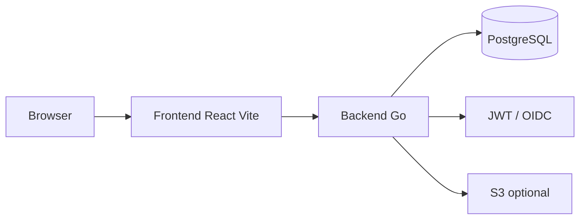

# The Nom Database

[](https://github.com/obermarclp/the-nom-database/actions/workflows/ci.yml)
[](https://github.com/obermarclp/the-nom-database/actions/workflows/docker-publish.yml)
[](https://opensource.org/licenses/BSD-3-Clause)
[](https://obermarclp.github.io/the-nom-database)

A full-stack restaurant rating application with Google Maps integration, flexible authentication (local and OIDC), social features (lists, suggestions, activities), and multi-platform Docker support.

## Architecture



- **Browser** → **Frontend** (React, TypeScript, Vite, Tailwind) → **Backend** (Go, Gorilla Mux) → **PostgreSQL**. Auth via JWT or OIDC; menu/photo uploads to S3 or local storage.

## Features

- **Restaurants** – Create, update, delete; Google Maps search and place details
- **Multi-dimensional ratings** – Food, service, ambiance; optional review text and photos
- **Restaurant lists** – User-created lists and list items
- **Suggestions** – Community suggestions with approval workflow
- **RBAC** – Role-based permissions (admin, moderator, user)
- **Authentication** – None, local (JWT + Argon2id), OIDC (Authentik, Keycloak, Auth0, etc.), or both
- **Docker** – Pre-built images (GHCR), multi-platform; dev compose for local builds
- **UI** – Dark/light theme with persistence; brutalist design system

## Tech stack

- **Backend:** Go 1.24, PostgreSQL 16, Gorilla Mux
- **Frontend:** React 18, TypeScript, Vite, Tailwind CSS
- **Auth:** JWT (Argon2id), OIDC
- **Infrastructure:** Docker, GitHub Actions, Nginx

## Quick start

### Prerequisites

- Docker and Docker Compose
- [Google Maps API key](https://developers.google.com/maps/documentation/javascript/get-api-key)

### Run with pre-built images

```bash
git clone https://github.com/obermarclp/the-nom-database.git
cd the-nom-database

cp .env.example .env
# Edit .env and set GOOGLE_MAPS_API_KEY (and DATABASE_URL if needed)

docker compose up -d
```

Open **http://localhost:3000**.

### Development mode (build locally)

```bash
docker compose -f docker-compose.dev.yml up --build
```

## Project structure

```
├── backend/          # Go API (cmd/server, internal/handlers, models, etc.)
├── frontend/         # React app (Vite, Tailwind)
├── docs/             # Documentation site (Hugo + Lotus Docs)
├── db/               # Legacy migrations (see backend/db/migrations_new for active)
├── nginx/            # Production reverse proxy config
├── .env.example      # Environment template
├── docker-compose.yml
└── docker-compose.dev.yml
```

## Configuration

**Required:**

- `DATABASE_URL` – PostgreSQL connection string (set by Docker Compose or explicitly)
- `GOOGLE_MAPS_API_KEY` – Google Maps/Places API key

**Authentication (optional):**

- `AUTH_MODE` – `none` | `local` | `oauth` | `both` (default: `none`)
- `JWT_SECRET_KEY` – Required for `local` or `both`
- `OIDC_ISSUER_URL`, `OIDC_CLIENT_ID`, `OIDC_CLIENT_SECRET` – For `oauth` or `both`

See [.env.example](.env.example) and the [documentation](https://obermarclp.github.io/the-nom-database) for the full list.

## API and documentation

- **Interactive API:** When the backend is running, Swagger UI is at [http://localhost:8080/api/docs](http://localhost:8080/api/docs).
- **Full documentation:** [obermarclp.github.io/the-nom-database](https://obermarclp.github.io/the-nom-database). The docs site is built with [Hugo](https://gohugo.io/) and the [Lotus Docs](https://lotusdocs.dev/) theme.

Main endpoint groups: health (`/api/health`, `/api/health/db`), restaurants, ratings, categories, food types, lists, auth, user profile. See the [API docs](https://obermarclp.github.io/the-nom-database/docs/configuration/api/) for the complete reference.

## Docker images

Pre-built images are published to GitHub Container Registry:

```bash
docker pull ghcr.io/obermarclp/the-nom-database/backend:latest
docker pull ghcr.io/obermarclp/the-nom-database/frontend:latest
```

Tags: `latest`, `develop`, `v1.0.0`, etc.

## Contributing

See the [Contributing guide](https://obermarclp.github.io/the-nom-database/docs/development/contributing/) and [LICENSE](LICENSE).

1. Fork the repo, create a feature branch, make changes, run tests, open a PR.
2. Follow the [Git workflow](https://obermarclp.github.io/the-nom-database/docs/development/git-workflow/) for branching and releases.

## License

BSD 3-Clause License – see [LICENSE](LICENSE).

## Support

- **Documentation:** [obermarclp.github.io/the-nom-database](https://obermarclp.github.io/the-nom-database)
- **Issues:** [GitHub Issues](https://github.com/obermarclp/the-nom-database/issues)
- **Discussions:** [GitHub Discussions](https://github.com/obermarclp/the-nom-database/discussions)
