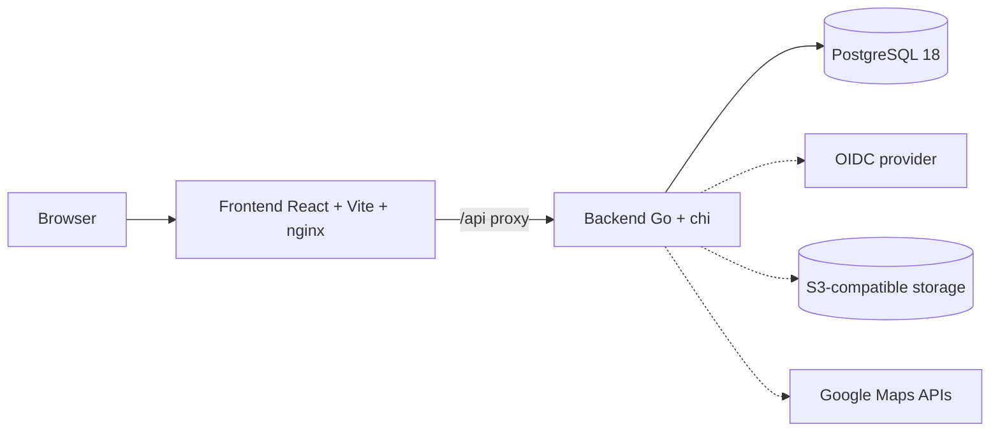

<p align="center">
  
</p>

<p align="center">
  <a href="https://github.com/OberMarcLP/the-nom-database/actions/workflows/ci.yml"></a>
  <a href="https://github.com/OberMarcLP/the-nom-database/actions/workflows/docker-publish.yml"></a>
  <a href="https://github.com/OberMarcLP/the-nom-database/releases"></a>
  <a href="LICENSE"></a>
  <a href="https://obermarclp.github.io/the-nom-database"></a>
</p>

**The Nom Database** is a self-hostable, full-stack restaurant rating app: rate food, service and ambiance, attach photos, keep lists, and let your friends suggest new places — with Google Maps integration, OIDC or local auth, and S3-compatible photo storage.

## Features

- **Restaurants** — Google Places search & details, price range ($–$$$$), map view with Advanced Markers
- **Multi-dimensional reviews** — food / service / ambiance ratings, comments, photo uploads with captions
- **Suggestions workflow** — community suggestions, moderated "Test & Review" conversion (first review incl. photos)
- **Social** — user profiles with avatars, restaurant lists, helpful votes, activity feed
- **RBAC** — roles & fine-grained permissions (e.g. `restaurants.delete`), admin panel with moderation, analytics and audit log
- **Auth, your way** — local (JWT + Argon2id, rotating httpOnly refresh cookies) and/or any OIDC provider (Authentik, Keycloak, Auth0, …)
- **Storage, your way** — AWS S3 or any S3-compatible endpoint (MinIO, Garage, Cloudflare R2, …) with automatic cleanup on delete; local-disk fallback
- **Ops-friendly** — multi-arch Docker images (amd64/arm64) on GHCR with SBOM + provenance, health checks, metrics summary, structured logging

## Architecture



The frontend nginx proxies `/api/*` to the backend, so everything runs under one origin. Browser runtime config (Google Maps key, map ID) is served by the backend via `GET /api/config` — published images contain no baked-in keys.

## Quick start (Docker)

```bash
git clone https://github.com/OberMarcLP/the-nom-database.git
cd the-nom-database
cp .env.example .env   # then edit: set JWT_SECRET_KEY, keys, etc.
docker compose up -d
```

- Frontend: http://localhost:3000 · API: http://localhost:8080/api · Swagger: http://localhost:8080/api/docs
- Images are pulled from GHCR (`ghcr.io/obermarclp/the-nom-database/{backend,frontend}`, tags: `latest`, `2`, `2.5`, `v2.5.1`, …)
- On first start a default `admin` user is created — the password comes from `ADMIN_DEFAULT_PASSWORD` or is generated and printed to the backend log

For local development (builds from source):

```bash
docker compose -f docker-compose.dev.yml up --build
# or granular: make db && make backend / make frontend
```

## Configuration

All configuration is environment-based — see [.env.example](.env.example) for the full annotated list.

| Variable | Purpose |
| --- | --- |
| `DATABASE_URL` | PostgreSQL connection string (required) |
| `AUTH_MODE` | `none` · `local` · `oauth` · `both` |
| `JWT_SECRET_KEY` | required for `local`/`both` (`openssl rand -base64 32`) |
| `OIDC_ISSUER_URL` / `OIDC_CLIENT_ID` / `OIDC_CLIENT_SECRET` | OIDC provider settings |
| `OIDC_REDIRECT_URL` | public backend callback, e.g. `https://your.domain/api/auth/oidc/callback` |
| `FRONTEND_URL` | public frontend URL (post-login redirect) |
| `GOOGLE_MAPS_API_KEY` | server key for the Places proxy (no referrer restriction) |
| `GOOGLE_MAPS_BROWSER_KEY` | optional referrer-restricted key served to the browser |
| `GOOGLE_MAPS_MAP_ID` | optional Map ID for Advanced Markers |
| `AWS_ACCESS_KEY_ID` / `AWS_SECRET_ACCESS_KEY` / `AWS_REGION` / `S3_BUCKET_NAME` | photo storage credentials |
| `S3_ENDPOINT` | optional S3-compatible endpoint (MinIO, Garage, R2, …), path-style addressing |
| `ALLOWED_ORIGINS` | CORS origins (comma-separated) |
| `COOKIE_SECURE` | force the Secure flag on the refresh cookie (default: auto-detect) |

## Project structure

```
├── backend/          # Go API (cmd/server, internal/handlers, models, etc.)
├── frontend/         # React app (Vite, Tailwind)
├── docs/             # Documentation site (Hugo + Lotus Docs)
├── nginx/            # Production reverse proxy config
├── .env.example      # Environment template
├── docker-compose.yml        # production: pre-built GHCR images
└── docker-compose.dev.yml    # development: build from source
```

## Documentation

- 📚 **[Project docs](https://obermarclp.github.io/the-nom-database)** — setup, authentication, deployment guides (Hugo + Lotus Docs)
- 🧭 **API reference** — Swagger UI at [`/api/docs`](http://localhost:8080/api/docs) on a running backend
- 📝 **[CHANGELOG](CHANGELOG.md)** — Keep-a-Changelog format, semver releases
- 🤝 **[Contributing](CONTRIBUTING.md)** — dev setup, conventions, release process

## Tech stack

Go 1.26 · chi v5 · PostgreSQL 18 · pgx · golang-migrate · React 18 · TypeScript · Vite · Tailwind CSS · React Query · Docker Buildx (multi-arch) · GitHub Actions

## Support

- **Documentation:** [obermarclp.github.io/the-nom-database](https://obermarclp.github.io/the-nom-database)
- **Issues:** [GitHub Issues](https://github.com/OberMarcLP/the-nom-database/issues)

## License

[BSD 3-Clause](LICENSE) © OberMarcLP
